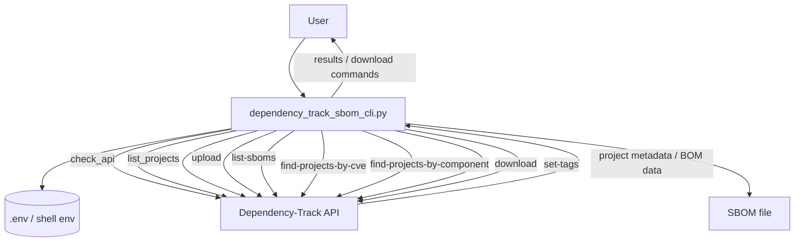

# sbom_playground
Play area for sbom testing and dependency track.

## Dependency-Track SBOM API PoC (Python)

This repo now includes a small MVP CLI: `dependency_track_sbom_cli.py`

### MVP flow


### Prerequisites
- Python 3.9+
- A running Dependency-Track instance (for local testing on MacBook, commonly `http://localhost:8080`)
- A Dependency-Track API key

### Configure environment
The CLI now reads values from either shell environment variables or a local `.env` file.

1) Copy the example file:
```bash
cp .env.example .env
```

2) Edit `.env`:
```bash
DEPENDENCY_TRACK_BASE_URL="http://localhost:8080"
DEPENDENCY_TRACK_API_KEY="<your-api-key>"
```

You can still use shell exports if you prefer:
```bash
export DEPENDENCY_TRACK_BASE_URL="http://localhost:8080"
export DEPENDENCY_TRACK_API_KEY="<your-api-key>"
```

### Quick Start Verification
Load variables from `.env` in your current shell:
```bash
set -a
source .env
set +a
```

Check network reachability and API key authentication:
```bash
python3 dependency_track_sbom_cli.py --check_api
```

List projects (first page) to verify authenticated API access:
```bash
python3 dependency_track_sbom_cli.py --list_projects
```

List a custom page and page size:
```bash
python3 dependency_track_sbom_cli.py --list_projects --page-number 2 --page-size 25
```

### Upload an SBOM
```bash
python3 dependency_track_sbom_cli.py \
  upload \
  --sbom "/absolute/path/to/bom.json"
```

Project selection options:
- Existing project by UUID:
```bash
python3 dependency_track_sbom_cli.py \
  upload \
  --project-uuid "<project-uuid>" \
  --sbom "/absolute/path/to/bom.json"
```

- Auto-create project if it does not exist (name + version):
```bash
python3 dependency_track_sbom_cli.py \
  upload \
  --sbom "/absolute/path/to/bom.json" \
  --auto-create \
  --project-name "my-app" \
  --project-version "1.0.0"
```

- Optional tags on upload (works with existing or auto-created projects):
```bash
python3 dependency_track_sbom_cli.py \
  upload \
  --sbom "/absolute/path/to/bom.json" \
  --project-uuid "<project-uuid>" \
  --project-tags "prod,customer-facing,critical"
```

- Auto-create with tags in a single upload:
```bash
python3 dependency_track_sbom_cli.py \
  upload \
  --sbom "/absolute/path/to/bom.json" \
  --auto-create \
  --project-name "my-app" \
  --project-version "1.0.0" \
  --project-tags "prod,customer-facing,critical"
```

Set tags on an existing project (standalone):
```bash
python3 dependency_track_sbom_cli.py \
  set-tags \
  --project-uuid "<project-uuid>" \
  --project-tags "prod,customer-facing,critical"
```

If required arguments are not passed, the script prompts for them interactively (for example, project UUID, project name/version, or output path).

### List Available SBOMs
List project versions for an application name and show whether a BOM is available:
```bash
python3 dependency_track_sbom_cli.py \
  list-sboms \
  --project-name "proton-bridge"
```

Include ready-to-run download commands for each matching project version:
```bash
python3 dependency_track_sbom_cli.py \
  list-sboms \
  --project-name "proton-bridge" \
  --include-download-commands
```

### Find Projects by CVE
List all projects affected by a CVE (default source is `NVD`):
```bash
python3 dependency_track_sbom_cli.py \
  find-projects-by-cve \
  --cve "CVE-2021-44228"
```

Exclude inactive projects and print ready-to-run SBOM download commands:
```bash
python3 dependency_track_sbom_cli.py \
  find-projects-by-cve \
  --cve "CVE-2021-44228" \
  --exclude-inactive \
  --include-download-commands
```

Optionally filter affected projects by name using substring match:
```bash
python3 dependency_track_sbom_cli.py \
  find-projects-by-cve \
  --cve "CVE-2021-44228" \
  --search-text "proton"
```

### Find Projects by Component
Find projects by component purl (recommended):
```bash
python3 dependency_track_sbom_cli.py \
  find-projects-by-component \
  --purl "pkg:npm/lodash@4.17.21"
```

Find projects by component name (optionally with group/version) and include download commands:
```bash
python3 dependency_track_sbom_cli.py \
  find-projects-by-component \
  --component-name "lodash" \
  --component-version "4.17.21" \
  --include-download-commands
```

Scope to active/latest projects only:
```bash
python3 dependency_track_sbom_cli.py \
  find-projects-by-component \
  --component-name "log4j-core" \
  --exclude-inactive-projects \
  --only-latest-project-versions
```

### Download an SBOM
CycloneDX output:
```bash
python3 dependency_track_sbom_cli.py \
  download \
  --project-uuid "<project-uuid>" \
  --format cyclonedx \
  --output "/absolute/path/to/downloaded-bom.json"
```

SPDX output:
```bash
python3 dependency_track_sbom_cli.py \
  download \
  --project-uuid "<project-uuid>" \
  --format spdx \
  --output "/absolute/path/to/downloaded-bom.spdx"
```

### Notes
- The script uses `PUT /api/v1/bom` for upload.
- The script uses `GET /api/v1/bom/{format}/project/{project_uuid}?download=true` for download.
- The script uses `GET /api/v1/vulnerability/source/{source}/vuln/{vuln}/projects` to find affected projects by CVE.
- The script uses `GET /api/v1/component/identity` to find projects by component identity filters (purl/cpe/name/version).
- If download returns JSON with a `bom` field, it is automatically base64-decoded before writing to disk.
